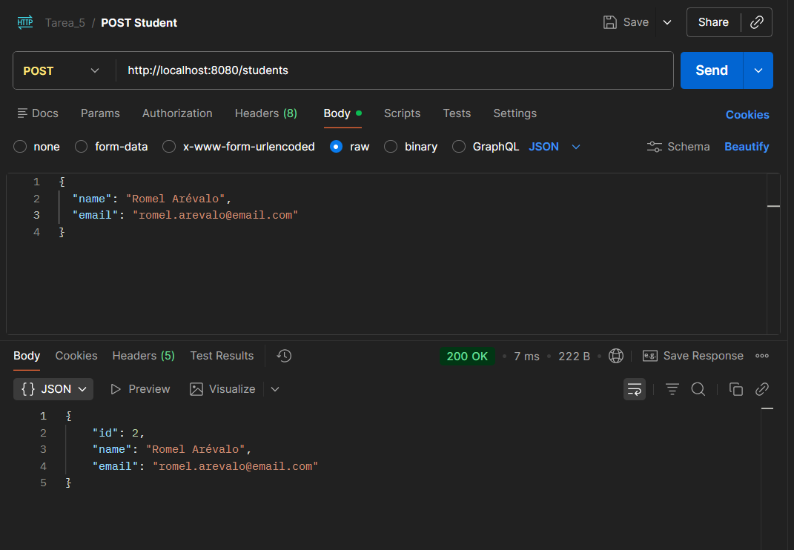
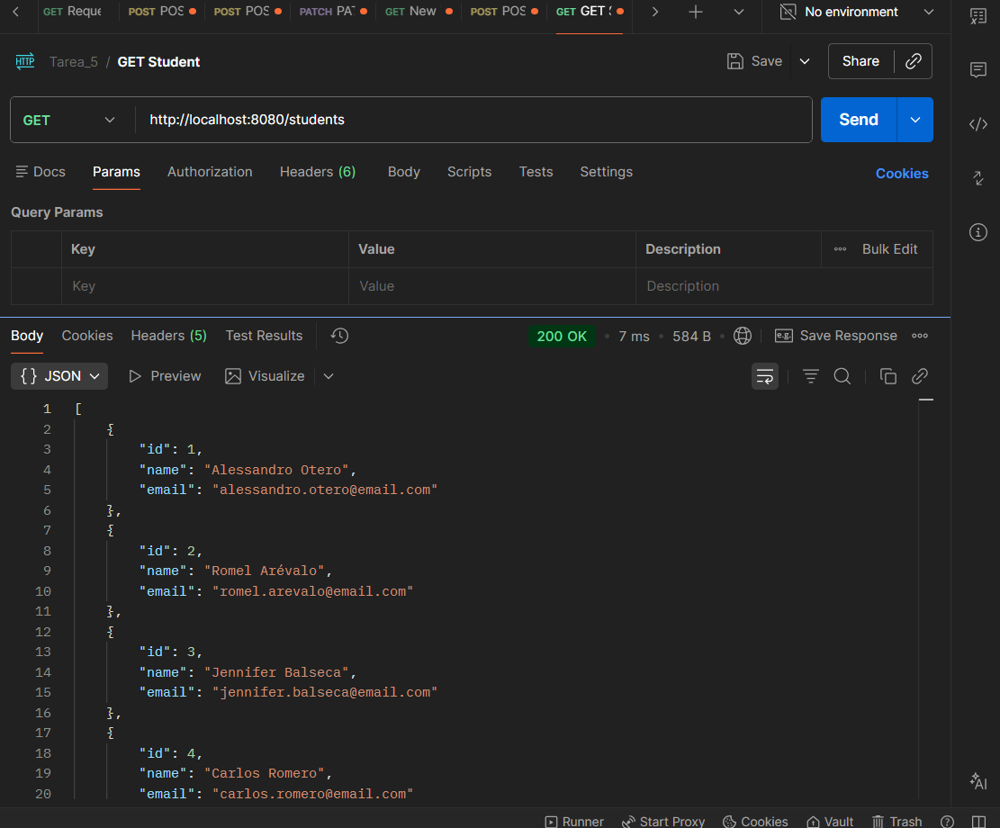

# API REST de Gestión de Estudiantes
*Pontificia Universidad Católica del Ecuador*

Proyecto desarrollado en Spring Boot y Kotlin aplicando una arquitectura por capas (Controller, Service, Repository).

## Tecnologías Utilizadas
* **Lenguaje:** Kotlin
* **Framework:** Spring Boot 3.x
* **Gestor de Dependencias:** Gradle
* **Base de datos:** H2
* **Persistencia:** Spring Data JPA

## Estructura del Proyecto
El código está organizado bajo el paquete personalizado de la institución: `edu.puce.estudiantes`.

```text
src/main/kotlin/edu/puce/estudiantes
├── controller
│   └── StudentController.kt
├── service
│   └── StudentService.kt
├── repository
│   └── StudentRepository.kt
├── entity
│   └── Student.kt
├── dto
│   ├── StudentRequest.kt
│   └── StudentResponse.kt
└── EstudiantesApplication.kt
```

## Evidencias de Pruebas
Las pruebas fueron ejecutadas con éxito en Postman, verificando el comportamiento esperado del servidor con la base de datos H2:

1. **Prueba POST (`http://localhost:8080/students`):
Retorna un estado `200 Created` y devuelve el objeto JSON correspondiente con el ID auto-incremental.

### Registro de Estudiante (POST)



2. **Prueba GET (`http://localhost:8080/students`):
Retorna un estado `200 OK` devolviendo un arreglo JSON con todos los estudiantes guardados temporalmente en la memoria de la aplicación.

### Listado de Estudiantes (GET)
